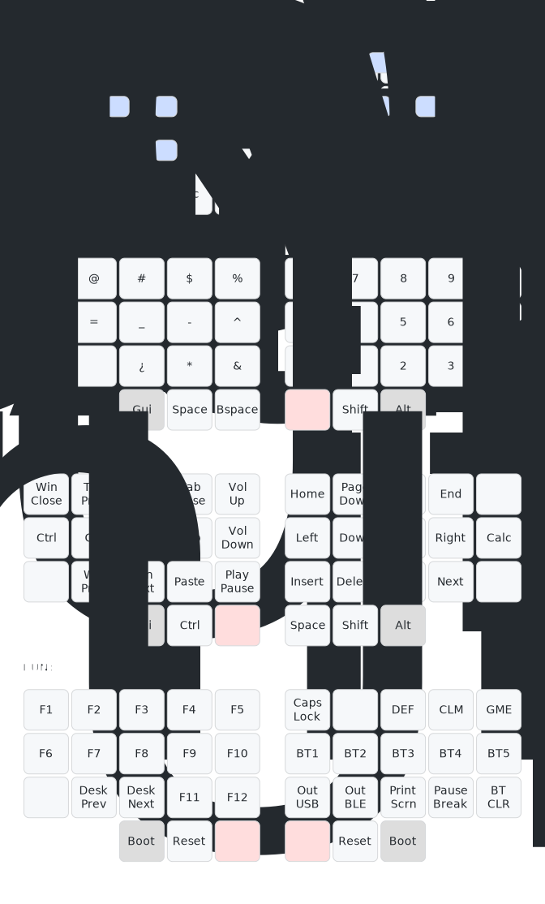

# Keymap Visualizer

> **Warning**
>
> This project is archived. Please check out [`keymap-drawer`](https://github.com/caksoylar/keymap-drawer) instead, which generalizes and improves upon this script.

This is a visualizer for keymaps, similar to [`keymap`](https://github.com/callum-oakley/keymap) which was used as a starting point.
Requires `python >= 3.8`, `pyyaml` and `pydantic` packages (`pip install --user pyyaml pydantic`) for reading and validating input YAML configs.

## Differences from original
- Supports non-split and custom-sized layouts
    - Arbitrary row/col sizes, number of thumb keys for splits
- Decouples data and drawing logic by reading physical layout and keymap definitions from YAML files
- Supports hold-tap keys
- Supports horizontal `N`u keys for integer `N > 1`
    - Defined by consecutive identical non-null key definitions
- Supports combos
    - Only two neighboring positions (horizontal or vertical)
    - Uses ZMK-like position indices (starting from 0, going right then down)
- Layer labels
- Slightly different styling

## Split layout example
3x5 layout with 2 or 3 thumb keys on each side:
```sh
python draw.py keymaps/3x5.yaml >svg/3x5.svg
```



## Non-split layout example
4x12 ortho layout à la Planck with MIT layout:
```sh
python draw.py keymaps/4x12.yaml >svg/4x12.svg
```


